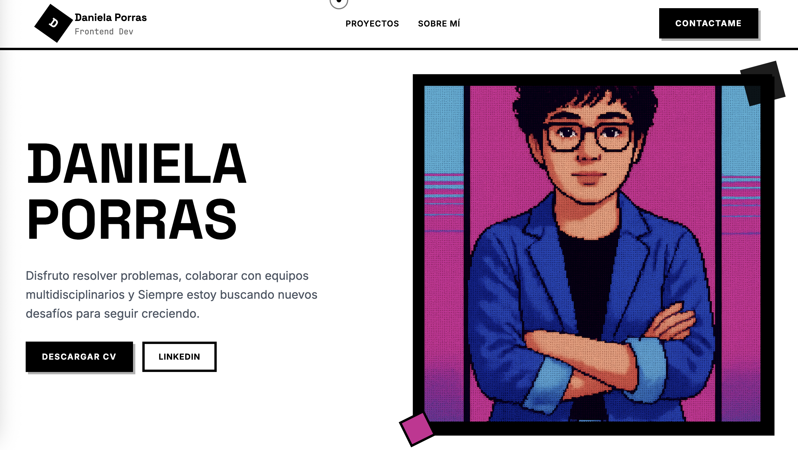

# 🎨 Portfolio Brutalist - Daniela Porras

Un portfolio moderno con diseño brutalist que combina elementos visuales impactantes con animaciones fluidas y una experiencia de usuario excepcional.



⭐ Si este proyecto te resultó útil, ¡dale una estrella!

🔗 **[Ver Demo en Vivo](https://portfolio-new-inky-nine.vercel.app/)**

## ✨ Características

- **🎯 Diseño Brutalist Moderno**: Interfaces llamativas con elementos gráficos Bold
- **⚡ Animaciones GSAP**: Transiciones fluidas y efectos visuales impresionantes
- **🎨 Custom Cursor**: Cursor personalizado que se adapta al contexto
- **📱 Responsive Design**: Optimizado para todos los dispositivos
- **🖼️ Efectos Glitch**: Elementos visuales con efectos de fragmentación RGB
- **🎪 Bento Grid Layout**: Disposición moderna de proyectos tipo masonry
- **🌈 Paleta de Colores Cohesiva**: Combinación de blanco/negro con acentos estratégicos

## 🛠️ Tecnologías Utilizadas

- **Frontend Framework**: React 19.1.1
- **Build Tool**: Vite 7.1.7
- **Styling**: Tailwind CSS v3.4
- **Animations**: GSAP 3.13.0 + ScrollTrigger
- **Typography**: Inter, JetBrains Mono, Space Grotesk
- **Smooth Scroll**: Lenis
- **Language**: JavaScript ES6+

## 🚀 Instalación y Configuración

### Prerrequisitos
- Node.js 18+
- npm o yarn

### Pasos de instalación

1. **Clonar el repositorio**
   ```bash
   git clone https://github.com/tu-usuario/portfolio-new.git
   cd portfolio-new
   ```

2. **Instalar dependencias**
   ```bash
   npm install
   ```

3. **Ejecutar en desarrollo**
   ```bash
   npm run dev
   ```

4. **Construir para producción**
   ```bash
   npm run build
   ```

5. **Vista previa de producción**
   ```bash
   npm run preview
   ```

## 📁 Estructura del Proyecto

```
src/
├── components/           # Componentes React reutilizables
│   ├── Header.jsx       # Navegación principal
│   ├── Hero.jsx         # Sección principal con imagen glitch
│   ├── About.jsx        # Información personal y skills
│   ├── DraggableBentoGrid.jsx  # Grid de proyectos
│   ├── Footer.jsx       # Pie de página
│   └── CustomCursor.jsx # Cursor personalizado
├── index.css           # Estilos globales y utilidades
└── App.jsx            # Componente principal

public/
├── images/            # Recursos de imagen
├── screenshots/       # Capturas del portfolio
└── CV_Daniela_Porras.pdf  # CV descargable
```

## 🎨 Características del Diseño

### Cursor Personalizado
- **Adaptativo**: Cambia de color según el fondo (blanco en áreas negras)
- **Interactivo**: Se escala en hover sobre links y botones
- **Fluido**: Animaciones suaves con GSAP

### Efectos Visuales
- **Glitch Effects**: Fragmentación RGB en la imagen principal
- **Parallax Sutil**: Movimiento suave en scroll
- **Hover States**: Micro-interacciones en todos los elementos
- **Stagger Animations**: Animaciones escalonadas en listas

### Responsive Design
- **Mobile First**: Diseño optimizado para móviles
- **Breakpoints**: Adaptación fluida en todos los tamaños
- **Performance**: Carga rápida y transiciones suaves

## 🔧 Personalización

### Colores
Los colores principales están definidos en `src/index.css`:
```css
:root {
  --bg: #ffffff;
  --fg: #000000;
  --accent: #000000;
  --color-accent: #cd2594;
  --brutal-border: #000000;
  --text-muted: #666666;
}
```

### Proyectos
Edita el array de proyectos en `src/components/DraggableBentoGrid.jsx`:
```javascript
const projects = [
  {
    id: 1,
    title: "Tu Proyecto",
    description: "Descripción del proyecto",
    tech: ["React", "GSAP", "Tailwind"],
    size: "large", // large, medium, small
    color: "bg-white",
    textColor: "text-black"
  }
];
```

### CV y Enlaces
- Reemplaza `public/CVDanielaPorras_frontend.pdf` con tu CV
- Actualiza los enlaces de LinkedIn en los componentes Header y Hero

## 📱 Secciones

1. **Header**: Navegación fija con logo animado
2. **Hero**: Presentación principal con imagen glitch y CTAs
3. **Projects**: Grid de proyectos con efectos hover
4. **About**: Información personal y stack tecnológico
5. **Footer**: Enlaces y información de contacto

## 🎯 Optimizaciones

- **CSS Custom Properties**: Variables CSS para fácil personalización
- **Component Composition**: Arquitectura de componentes reutilizables
- **Performance**: Lazy loading y optimización de animaciones
- **SEO Ready**: Estructura semántica y meta tags
- **Accessibility**: Navegación por teclado y contraste adecuado

## 🚀 Deploy

### Vercel (Recomendado)
```bash
npm install -g vercel
vercel
```

### Netlify
```bash
npm run build
# Sube la carpeta dist/
```

### GitHub Pages
```bash
npm run build
# Configura GitHub Actions o sube manualmente
```
